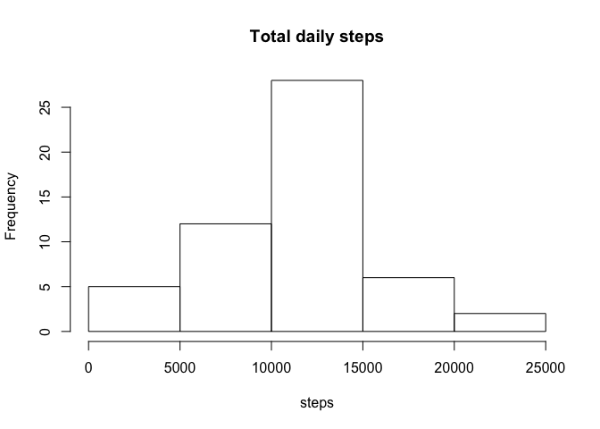
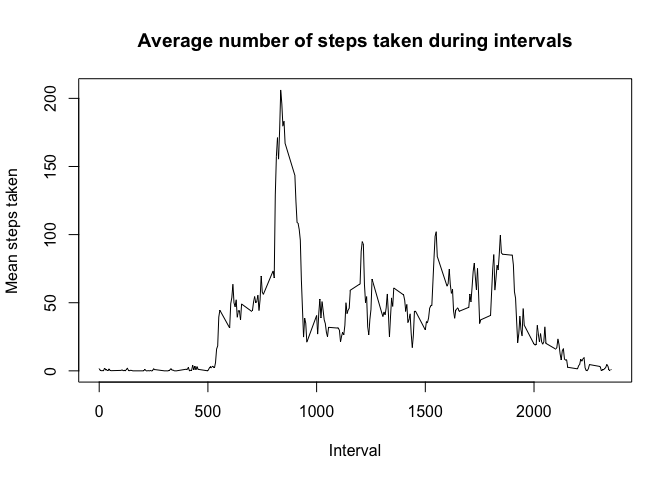
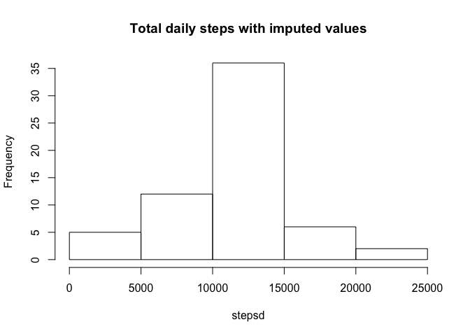
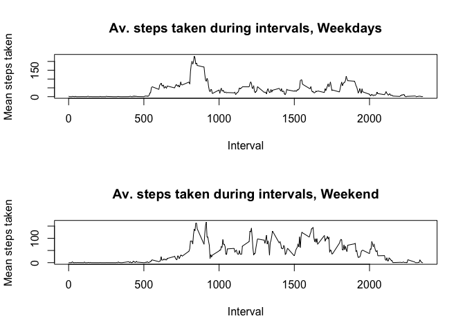

# Reproducible Research: Peer Assessment 1


## Loading and preprocessing the data
Load (unzip & load) data and convert dates to date class.

```r
unzip("activity.zip") # unzip data
data <- read.csv("activity.csv") # read data
data$date <- as.Date(data$date) # convert dates to class date
```


## What is mean total number of steps taken per day?
Calculate the total, mean and median number of steps taken per day and plot a histogram of daily steps.

```r
steps <- xtabs(steps ~ date, data = data) # tab by day
print(steps) # total steps by day
```

```
## date
## 2012-10-02 2012-10-03 2012-10-04 2012-10-05 2012-10-06 2012-10-07 
##        126      11352      12116      13294      15420      11015 
## 2012-10-09 2012-10-10 2012-10-11 2012-10-12 2012-10-13 2012-10-14 
##      12811       9900      10304      17382      12426      15098 
## 2012-10-15 2012-10-16 2012-10-17 2012-10-18 2012-10-19 2012-10-20 
##      10139      15084      13452      10056      11829      10395 
## 2012-10-21 2012-10-22 2012-10-23 2012-10-24 2012-10-25 2012-10-26 
##       8821      13460       8918       8355       2492       6778 
## 2012-10-27 2012-10-28 2012-10-29 2012-10-30 2012-10-31 2012-11-02 
##      10119      11458       5018       9819      15414      10600 
## 2012-11-03 2012-11-05 2012-11-06 2012-11-07 2012-11-08 2012-11-11 
##      10571      10439       8334      12883       3219      12608 
## 2012-11-12 2012-11-13 2012-11-15 2012-11-16 2012-11-17 2012-11-18 
##      10765       7336         41       5441      14339      15110 
## 2012-11-19 2012-11-20 2012-11-21 2012-11-22 2012-11-23 2012-11-24 
##       8841       4472      12787      20427      21194      14478 
## 2012-11-25 2012-11-26 2012-11-27 2012-11-28 2012-11-29 
##      11834      11162      13646      10183       7047
```

```r
mean(steps) # mean steps
```

```
## [1] 10766.19
```

```r
median(steps) # median steps
```

```
## 2012-11-12 
##      10765
```

```r
hist(steps, main = "Total daily steps") # plot histogram 
```

<!-- -->


## What is the average daily activity pattern?
Find the interval with max steps and plot of the average number of steps taken during intervals.

```r
library(dplyr) # load dplyr package
```

```
## 
## Attaching package: 'dplyr'
```

```
## The following objects are masked from 'package:stats':
## 
##     filter, lag
```

```
## The following objects are masked from 'package:base':
## 
##     intersect, setdiff, setequal, union
```

```r
int <- group_by(data, interval) # group by interval
intdata <- summarize(int, mst = mean(steps, na.rm = TRUE)) # average steps on interval
mr <- which(intdata$mst == max(intdata$mst,2)) # row number of max steps
intdata[mr,1] # interval with max steps
```

```
## # A tibble: 1 x 1
##   interval
##      <int>
## 1      835
```

```r
plot(intdata$interval, intdata$mst, type = "l", main = "Average number of steps taken during intervals", xlab = "Interval", ylab = "Mean steps taken") # plot number of steps
```

<!-- -->


## Imputing missing values
Calculate the number of missing values, create a new dataset with missing values replaced with the average of that interval and calculate the mean and median steps with imputed missing values.

```r
sum(is.na(data$steps)) # number of missing values
```

```
## [1] 2304
```

```r
data$nas <- is.na(data$steps) # create var for missing data
rows <- which(data$nas) # rows where data is missing

d <- data # new dataframe for data with imputed values

for (i in 1:length(rows)) {
    d$steps[rows[i]] <- intdata$mst[intdata$interval == d$interval[rows[i]]]
    } # replace missing values with average for the interval

stepsd <- xtabs(steps ~ date, data = d) # tab by date

hist(stepsd, main = "Total daily steps with imputed values")
```

<!-- -->

```r
mean(stepsd) # mean steps with imputed values
```

```
## [1] 10766.19
```

```r
median(stepsd) # median steps with imputed values
```

```
## 2012-11-04 
##   10766.19
```


## Are there differences in activity patterns between weekdays and weekends?
Plot average steps taken during interval by weekend/weekday. 


```r
d$wend <- weekdays(d$date) =="Saturday" | weekdays(d$date) =="Sunday" # create var for weekend

par(mfcol = c(2, 1)) # set-up panel plot

# plot 1 - weekdays
int_nwend <- d[d$wend == FALSE,] # subset data 
int_nwend2 <- group_by(int_nwend, interval) # group by interval
int_nwend_dat <- summarize(int_nwend2, mst = mean(steps, na.rm = TRUE)) # mean by interval
plot(int_nwend_dat$interval, int_nwend_dat$mst, type = "l", main = "Av. steps taken during intervals, Weekdays", xlab = "Interval", ylab = "Mean steps taken") #plot weekdays

#plot 2 - weekends
int_wend <- d[d$wend == TRUE,] # subset data
int_wend2 <- group_by(int_wend, interval)# group by interval
int_wend_dat <- summarize(int_wend2, mst = mean(steps, na.rm = TRUE)) # mean by interval
plot(int_wend_dat$interval, int_wend_dat$mst, type = "l", main = "Av. steps taken during intervals, Weekend", xlab = "Interval", ylab = "Mean steps taken") #plot weekend
```

<!-- -->
